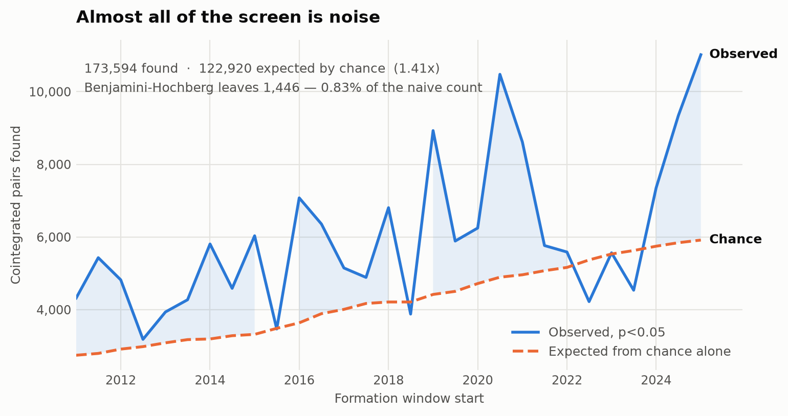
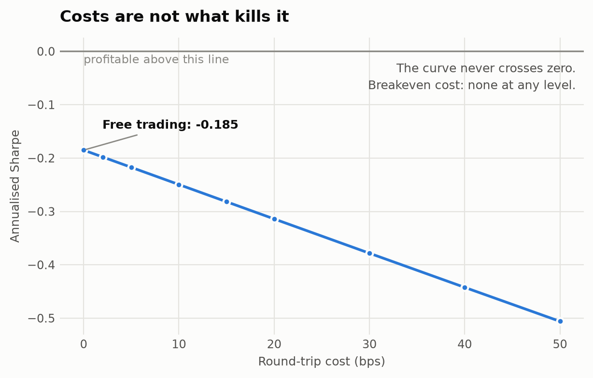
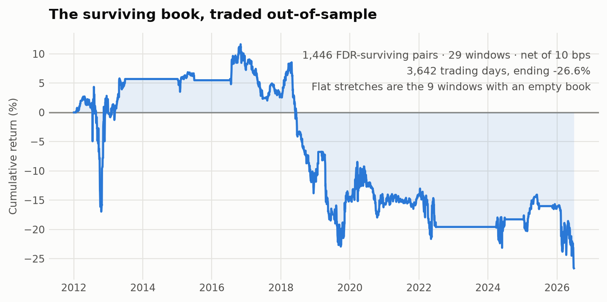
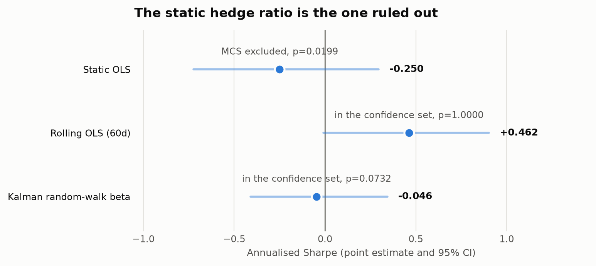

# Cointegration Statistical Arbitrage Under Multiple-Testing Correction

**A point-in-time study of the S&P 500, 2011–2026.**

> **Revision note (2026-09-08).** An independent adversarial review of this study
> found a lookahead bug that **reversed the Stage C conclusion** and an invalid
> estimator that inflated the headline SR\* by ~5x. Both are fixed; the corrected
> results are what this document reports, and §6 records exactly what was wrong and
> how it was caught. The first version of §4 claimed the opposite of what §4 now
> says. That reversal is the most instructive thing in this paper.

---

## Summary

A naive cointegration screen over the S&P 500 identifies **173,594 "significant" pairs**.
Under the null of no cointegration anywhere, chance alone predicts **122,920** of them.

That ratio — **1.41x** — is the core finding. After Benjamini–Hochberg FDR control,
**1,446 pairs survive**, 0.83% of the naive count, and **9 of 29 windows hold nothing
tradable at all**. Traded out-of-sample under the Gatev–Goetzmann–Rouwenhorst protocol
with a static hedge ratio, the surviving book returns an annualised Sharpe of **−0.25**
against a pre-registered bar of ≥0.50.

Three hypotheses were pre-registered, frozen and pushed to a remote before any code ran.

| stage | question | verdict |
|---|---|---|
| **A** — selection | does cointegration selection retain edge after correction? | **FAIL 0/3** |
| **C** — estimation | is a time-varying hedge ratio distinguishable from static OLS? | **PASS 1/1** |
| **B** — allocation | does convex allocation beat equal weighting? | **PASS 1/1**, and void |

Stages run **A → C → B**: dependency order, not alphabetical. Estimation needs a book to
estimate on; allocation needs an estimator chosen.

## 1. The question

Pairs trading is the most-replicated strategy in retail quantitative finance, and its
selection step is a multiple-testing problem that is almost never treated as one. Testing
every pair in the index means more than 100,000 simultaneous hypothesis tests per
formation window. At α=0.05, tens of thousands of "cointegrated" pairs are guaranteed by
construction.

The question is not whether pairs trading works. It is **what is left when you account
for having looked 2.46 million times.**

**Registered prior, written before the run:** Rad, Low & Faff (2016) find both distance
and cointegration pair selection decayed sharply post-2009. Little or no edge was
expected.

## 2. Data and protocol

| | |
|---|---|
| **Universe** | Point-in-time S&P 500 membership. 829 tickers ever a member, 2011–2026; today's index holds 503 |
| **Protocol** | GGR: 12-month formation, 6-month trading, non-overlapping, rolled 6 months. **29 windows**, 2012-01 → 2026-06 |
| **Selection** | Engle–Granger on log prices, every eligible pair, formation window only |
| **Correction** | Benjamini–Hochberg FDR at q=0.10; book capped at top 20 by test statistic |
| **Trading** | Enter \|z\|>2, exit \|z\|<0.5, force-close at window end. **Fixed at GGR values, never tuned** |
| **Construction** | Dollar-neutral, hedge-ratio normalised by (1+\|β\|), return on committed capital |
| **Costs** | **10 bps one-way per leg** = 20 bps round-trip. Swept 0–50 |
| **Benchmark** | Zero-return series. The book is market-neutral; an SPY criterion would be blind to what it is |

**A correction on the cost unit.** The registration and the first version of this paper
called the base case "10 bps round-trip". It is not: cost is charged on |Δw| for each leg
separately, so a full entry-and-exit pays **20 bps of gross exposure**, measured on a
controlled single trade. The deviation is *conservative* — it can only make a null more
negative, never manufacture one — so the graded result stands and the label is what was
corrected. At the registered 10 bps round-trip (cost_bps=5) the Sharpe is **−0.2173**.

Point-in-time membership matters more than it looks. Screening fifteen years against
today's constituent list pre-filters the universe to companies that survived.

## 3. Stage A — selection

**Bar frozen and pushed before the run** (`73543a53`).

### 3.1 How much of the screen is noise

| | count |
|---|---|
| Engle–Granger tests | **2,458,393** |
| "Significant" at α=0.05 | **173,594** |
| Expected from chance alone | **122,920** |
| Ratio | **1.41x** |
| Surviving Benjamini–Hochberg at q=0.10 | **1,446** (0.83% of naive) |
| Windows with an empty book | **9 of 29** |
| Windows finding *fewer* than chance predicts | **4** |



The median window runs at 1.35x noise. Four windows come in **below** 1.0 — the screen
found fewer cointegrated pairs than random data would have produced.

FDR was chosen over Bonferroni deliberately. Bonferroni controls the probability of even
one false positive, which at this scale means a per-test threshold near 4e-7 and an
essentially empty book. FDR controls the expected *proportion* of the selected set that
is false — the question actually being asked.

### 3.2 What the surviving book earns

```
cost (bps one-way/leg)    annualised Sharpe     total return
        0                     -0.1851             -19.76%
        5                     -0.2173             -23.20%
       10                     -0.2496             -26.64%
       20                     -0.3140             -33.51%
       50                     -0.5059             -54.14%
```



**Breakeven cost: none. The curve never crosses zero.**

A common and comfortable finding is that a strategy is real gross and destroyed by
transaction costs. **This one is not there gross.** At zero cost — free trading, infinite
liquidity — the Sharpe is still −0.1851 over 3,642 trading days.



The flat stretches are the nine windows whose books were empty after FDR control.

### 3.3 The grade

```
PRE-REGISTERED RESULT -- coint_A_selection
  bar is PUSHED: on origin/master as 73543a53

  metric                bar      observed   verdict
  sharpe_net         >= 0.5      -0.2496    FAIL
  dsr                >= 0.95      0.0000    FAIL
  spa_p              <= 0.05      0.8294    FAIL

  VERDICT: FAIL (0/3 criteria met)
```

**SR\* = 1.327.** That is the annualised Sharpe a search of 2,465,737 trials produces
from luck alone, and the deflated Sharpe probability against it is 1.2e-09.

**How SR\* is estimated, and how the first attempt got it wrong.** The deflated Sharpe
needs the dispersion of trial Sharpes *at the candidate's sample length*. The first
version measured Sharpe on **single pairs over ~125 days** and applied it to a **20-pair
book over 3,642 days**. Sharpe estimation noise scales as √(252/T), so at T=125 the noise
alone is √(252/125) = 1.4199 — almost exactly the 1.4451 that version measured, with
skew +0.04 and excess kurtosis −0.56 confirming it was *short*, not fat-tailed. It was
measuring the horizon, not the search, and it reported **SR\* = 7.288** — off by 5.4x.

The fix builds trials shaped like the candidate: 500 random 20-pair books, each traded
across all 29 windows. Their measured dispersion is 0.1096 — but those books draw from a
pool of only ~69 pairs per window, so they **share most of their constituents**, and
overlap biases the dispersion *down* (0.417x the √(252/3642)=0.2630 an annualised Sharpe
has from estimation noise alone). The graded figure therefore uses the **larger** of the
two, on the same logic that keeps `n_trials` at the registered 2,465,737 against an
actual 2,458,394: err conservative on a deflation bar.

Hansen SPA returns p = 0.8294 against a zero-return benchmark (MC standard error 0.0027).
**With one candidate there is no multiplicity for SPA to price** — it reduces to a
one-sided bootstrap test of mean return. It is registered that way, so it is not a moved
goalpost, but it does not do multiple-testing work here. The FDR step and the deflated
Sharpe do that.

**Stated honestly:** the 95% CI on Sharpe is **[−0.72, +0.30] and contains zero.** The
correct claim is *no edge detected, point estimate negative* — not *it loses money*.

## 4. Stage C — estimation

**Bar frozen before the run** (`ec59631b`): static OLS lands in the MCS *excluded* set.

> **This section previously claimed the opposite of what follows.** It reported that the
> Model Confidence Set excluded the *Kalman* estimator and that "the more adaptive the
> hedge ratio, the worse it does". That was an artifact of the lookahead bug in §6.1. The
> registered verdict flipped FAIL → PASS when the bug was fixed. The bar was not touched.

Three hedge-ratio estimators, declared as a set up front and compared by Model Confidence
Set on Sharpe (`criterion="sharpe"`, `reps=20000`, `size=0.05`).

```
estimator      Sharpe    95% CI                 MCS p     MC stderr   verdict
static_ols    -0.2496   [-0.7229, +0.2958]     0.0199     0.0010     EXCLUDED
rolling_ols   +0.4620   [-0.0096, +0.9022]     1.0000     0.0000     INCLUDED
kalman        -0.0464   [-0.4088, +0.3430]     0.0732     0.0018     INCLUDED
```



**The Model Confidence Set excludes static OLS**, at p=0.0199. The registered claim is
met: `static_ols_excluded = 1`, **PASS 1/1**.

**Do not over-read it.** Rolling OLS's own interval is [−0.0096, +0.9022] and **touches
zero**. The set says static OLS can be ruled out; it does not say rolling OLS has an edge.
And the whole comparison sits on a book whose selection stage failed its own bar.

### 4.1 A mechanism, tested rather than asserted

An adaptive β *tracks* the spread, absorbing the divergence the strategy exists to trade.
Testable implication: adaptive estimators should spend less time beyond the entry
threshold.

| estimator | mean \|z\| | days \|z\|>2 | sd(β_t) |
|---|---|---|---|
| Static OLS | 2.547 | **50.3%** | 0.0000 |
| Rolling OLS (60d) | 1.007 | **9.5%** | 0.4505 |
| Kalman random-walk β | 0.967 | **3.6%** | 0.0235 |

**Absorption is confirmed, and it is large.** A static hedge ratio has the book beyond its
entry threshold half the time; rolling OLS cuts that to 9.5%, and the Kalman filter to
3.6%.

That also explains the Sharpe ordering, which the leaked version could not. Static OLS
trades almost continuously and loses. Rolling OLS trades selectively. **The Kalman filter
absorbs so much that it barely trades at all** — 3.6% of days — and lands near zero,
which is what a strategy that rarely takes a position should do.

## 5. Stage B — allocation

**Bar frozen before the run** (`aa565e04`): `sharpe_edge ≥ 0.10`.

```
decision variables   w ∈ R^k              signed dollar weight per pair
objective            max  μ'w − (λ/2)·w'Σw
subject to           ‖w‖₁          ≤ 1.00    gross exposure budget
                     |w_i|         ≤ 0.25    per-pair concentration cap
                     ‖w − w_prev‖₁ ≤ 0.50    turnover trust region
```

A quadratic program with an L1 ball, an L∞ box and an L1 trust region — convex, so the
solver returns a global optimum. Re-solved every 21 trading days on 60-day trailing
estimates, using only data strictly before the rebalance date. cvxpy/CLARABEL.

```
equal weight Sharpe  -0.2496
optimised Sharpe     -0.1044
sharpe_edge          +0.1452     bar >= 0.10     PASS 1/1
```

**The turnover charge was missing and is now applied.** The registered criterion says
"net of turnover", but the first run charged only the *pairs'* entry and exit costs — the
optimiser's own reallocation was free. Charging it at the same convention moves the edge
from +0.1896 to **+0.1452**. The criterion as originally reported had never been
evaluated.

### 5.1 The pass is void, and was pre-registered as void

> *"A pass here on a no-edge book would be evidence of overfitting the covariance, not
> evidence of skill, and must be reported that way if it happens."*
> — `coint_B_allocation`, registered before the run

It happened. The equal-weight benchmark's Sharpe CI is [−0.723, +0.296] and contains
zero, so μ is an estimate of noise. An optimiser that improves Sharpe by allocating
precisely across noise has fitted a covariance matrix. `allocate.py` carries a guard that
refuses to print the improvement as an edge.

One further caveat the guard does not cover: the optimiser's realised gross exposure
averages **0.540** against equal weight's 1.0, and it is flat on 21.8% of days. Part of
the Sharpe difference is simply less risk taken, not better allocation.

**This remains the most useful result in the study.** The only thing standing between it
and a reported "+0.15 Sharpe improvement" is a sentence written before the number existed.

## 6. What broke

Four defects. **None was found by code review.** Two were found by probes written for the
purpose; **two were found only by an independent adversarial pass over the finished
work.**

### 6.1 The trading path leaked the future — and it reversed a published conclusion

`trade.py` normalised the z-score with `np.nanmean(beta_t)`, where `beta_t` spans the
**trading** window. That mean built the *formation* spread whose μ/σ scale z on every
trading day, **including day 0**. The day-0 signal therefore depended on day-125 prices.

It hid for two compounding reasons:

1. **For static OLS, `beta_t` is constant, so its mean is that constant and nothing
   leaks.** Stage A — the headline — was causally clean *by luck of estimator choice, not
   by design*. Had the registered estimator been rolling OLS, the entire "no edge, negative
   even at zero cost" result would have been produced by a lookahead bug, and every check
   in this repository would still have passed.
2. **The causality probe tested the wrong level.** `test_lookahead.py` probed the estimator
   *functions*, which are genuinely causal, and never called `trade.pair_returns`. A causal
   estimator wrapped in a leaking normalisation passes an estimator-level probe.

Measured, perturbing trading day ≥40 and reading days 0–39 across 46 book pairs:

| estimator | leaking pairs, before | after fix |
|---|---|---|
| `static_ols` | 0 / 46 | 0 / 46 |
| `rolling_ols` | **24 / 46** (max 8.1e-02) | 0 / 46 |
| `kalman` | **32 / 46** (max 1.02e-01) | 0 / 46 |

The fix asks each estimator for its own β **as of the last formation day, from formation
data only**. Two independent repairs — one by the reviewer, one here — produce the same
reversal, which is the reassuring part.

The probe now runs end-to-end through `trade.pair_returns`, **and carries a meta-test at
that level**: a deliberately non-causal estimator must be caught, or a zero-leak result
means nothing. Measured: 23 of 24 pairs caught.

### 6.2 SR\* was a restatement of the trial horizon

Covered in §3.3. Reported 7.288, correct value 1.327, off by 5.4x. The Stage A verdict is
unaffected — the DSR fails against either — but the number was the paper's headline.

### 6.3 Twenty-five tickers returned a different company's prices

Found by chasing an outlier: one window returned **+72.7% on a two-pair book**, caused by
`PARA`, whose series splices a ~101,500 foreign listing onto Paramount's $3.

Twenty-five symbols were retired from the index and later *reassigned to a different
company*; the data source serves the new company's prices under the old symbol with no
error and no gap.

| symbol | index membership | prices actually returned |
|---|---|---|
| `FB` | 2013-12 → 2022-06, left as META | 2025-06 onward |
| `EMC` | 1996-03 → 2016-09, Dell | 2023-05 onward |
| `S` | 1996-01 → 2013-07, Sprint | 2021-06 onward, SentinelOne |
| `BEAM` | 1996-01 → 2014-05, Beam Inc | 2020-02 onward, Beam Therapeutics |
| `SE` | 2007-01 → 2017-02, Spectra Energy | 2017-10 onward, Sea Limited |

…plus twenty more. The 190 unpriceable delisted names are only the **visible** half of
the survivorship problem. **Missing data announces itself. Wrong data does not.**

**The first fix was worse than the bug.** An absolute price floor rejected **NVDA** —
split back-adjustment makes NVIDIA's legitimate 2011 close $0.36 — along with AIV, FSLR
and SEDG. It was replaced with two tests that need no arbitrary threshold: membership
overlap, and a plausible *terminal* price. Audited independently: **zero false positives**
among the 25 rejects.

*In practice the rule that removed PARA is a third check — a formation-window median above
$10,000 — added in the same commit. The two headline rules remove 16 slots between them.*

Note the direction: **the contaminated pair made money.** Removing it made every number
worse.

### 6.4 The Kalman filter's parameters saw the future

The first `kalman_beta` fit its variance parameters by MLE over formation *and* trading
concatenated. Filtered states were causal *given* those parameters; the parameters were
not. Caught by the estimator-level probe: perturbing the last trading day moved β on
earlier days by 3.8e-02.

## 7. Limitations

**Point-in-time membership fixes selection, not prices.** 190 of 829 union members
(22.9%) cannot be priced; coverage is **77.1%**. The residual bias is strictly smaller
than survivorship bias but not zero. A clean fix needs CRSP or Norgate.

The loss is **time-varying**: early windows lose proportionally more names (W00 has 332
eligible names against W28's 487), so the study is better-powered after ~2018.

- **The ticker-reuse filter is a full-sample rule applied to 2012 windows.** A name is
  barred everywhere based on its 2026 terminal price. 16 (ticker, window) slots are
  affected and CPWR would have been caught by the per-window check anyway, but this is
  outcome-dependent information entering universe construction, and it is disclosed
  rather than defended.
- **`n_trials` describes a slightly different universe than the graded run.** The bar was
  registered on the pre-data-fix panel (2,465,737) and the run enumerated 2,458,394. The
  larger figure is retained; the direction is conservative.
- **One protocol, one sample.** A null here is a statement about GGR-style cointegration
  selection on US large caps 2011–2026 — not about pairs trading in general.
- **A non-detection, not a disproof.** The CI contains zero.
- **Long/short, therefore untradable in a cash account.** No position was ever taken.

## 8. Reproducing

```bash
python formation.py       # panel, coverage, data-quality audit
python selection.py       # stage A: 2.46M Engle-Granger tests, ~40 min on 16 cores
python grade_A.py         # registered metrics + cost curve
python grade_C.py         # three estimators, Model Confidence Set
python mechanism_C.py     # the absorption table
python allocate.py        # convex allocation vs equal weight
python test_lookahead.py ; python test_data_quality.py
```

Bars were frozen with `prereg.freeze()`, which commits, pushes, and verifies the bytes
landed before returning. `prereg.grade()` raises on any registration that is not pushed.
All three were independently confirmed present on the remote, with the Stage C
registration committed 50 seconds before its results file was written.

Frozen blobs: **A** `73543a53` · **C** `ec59631b` · **B** `aa565e04`.

---

## References

Gatev, Goetzmann & Rouwenhorst (2006), *Pairs Trading: Performance of a Relative-Value
Arbitrage Rule*, Review of Financial Studies 19(3).

Rad, Low & Faff (2016), *The Profitability of Pairs Trading Strategies: Distance,
Cointegration, and Copula Methods*, Quantitative Finance 16(10).

Hansen (2005), *A Test for Superior Predictive Ability*, JBES 23(4).

Hansen, Lunde & Nason (2011), *The Model Confidence Set*, Econometrica 79(2).

Bailey & López de Prado (2014), *The Deflated Sharpe Ratio*, Journal of Portfolio
Management 40(5).

Benjamini & Hochberg (1995), *Controlling the False Discovery Rate*, JRSS-B 57(1).
